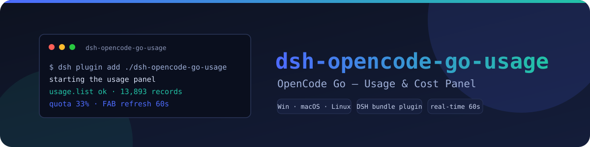
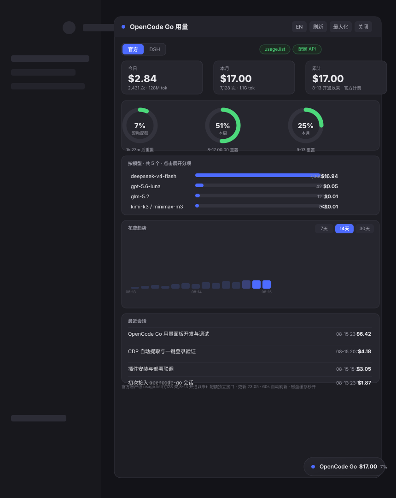

<p align="center">
  
</p>

<p align="center">
  <a href="LICENSE"></a>
  <a href="https://github.com/Xenia0922/dsh-opencode-go-usage"></a>
  
  
  
</p>

# OpenCode Go 用量面板

一个用于 [DeepSeek Harness](https://github.com/deepseek-ai/deepseek-harness) 的 DSH 插件。它在桌面右下角提供可拖动、可缩放的悬浮面板，用于查看 OpenCode Go 的账户级用量、配额和 DSH 会话分析。

数据在本机处理。网络请求只发往 `opencode.ai`，以及用于版本检查的 GitHub 公共 `package.json`；不会把 API key、Cookie 或用量数据发送给第三方。



## 功能

- 官方账户级用量：读取官网 `usage.list`，使用官方逐请求费用，支持跨设备数据。凭据通过本地配置提供。
- DSH 会话分析：按 DSH 会话、模型和日期统计 OpenCode Go 用量。
- 配额监控：显示滚动 5 小时、周、月配额、重置时间和消耗速度预测。
- 多 key 配额池：自动发现 `.credentials.yaml` 中的 `OPENCODE_GO_KEY_*`，支持切换和限流状态提示。
- 交互面板：FAB 拖动、标题栏拖动、边缘缩放、最大化、位置和大小持久化。
- 数据分析：按模型排行、费用分项、7/14/30 天趋势、最近会话和 CSV 导出。
- 中英文界面：可手动切换，也可以跟随 DSH 全局语言。
- 跨平台启动：支持 Windows、macOS、Linux 上的 Chromium 系浏览器调试端口。

## 快速安装

### 推荐：Bundle 插件

在插件仓库的**父目录**执行：

```sh
git clone https://github.com/Xenia0922/dsh-opencode-go-usage.git
dsh plugin --profile my-profile add ./dsh-opencode-go-usage
dsh --profile my-profile
```

Bundle 模式会随 DSH profile 启动，并通过本地 `webServer` 注册以下路由：

- `/ocgo-usage/fetch`：读取面板数据
- `/ocgo-usage/config`：保存官方凭据
- `/ocgo-usage/retry`：绕过缓存重新抓取

如果插件目录路径包含空格，而 `dsh plugin add` 无法正确解析，请把仓库移动到无空格路径，或使用 junction/link 指向无空格目录。

### 快速体验：动态加载

动态加载不需要构建，但只在当前 DSH 进程有效：

1. 在 DSH 会话中让 Agent 执行 `cordis_define`，`kind: new`，`idPrefix: zenus`。
2. 将 [`src/host.js`](src/host.js) 内容填入 `code.host`。
3. 将 [`src/client.js`](src/client.js) 内容填入 `code.client`。
4. 执行 `cordis_run` 并授权。

DSH 重启后动态定义会消失；长期使用请使用 Bundle 模式。

## 首次配置

安装完成后，右下角会出现 OpenCode Go FAB。官方视图采用一次性手动凭据配置：

1. 在普通浏览器中打开 `opencode.ai` 的 usage 页面。
2. 打开开发者工具，在 Application/Storage → Cookies 中复制 `auth` Cookie。
3. 从 usage 页面地址中复制 `workspaceId`（形如 `wrk_xxx`）。
4. 将两项填入面板并点击“保存并刷新”。

凭据保存后，后续刷新不需要再次登录，也不需要以调试模式启动浏览器。Safari、Firefox 也可以用于手动复制凭据。

手动填写：

- `authCookie`：浏览器开发者工具中 `opencode.ai` 的 `auth` Cookie 值。
- `workspaceId`：usage 页面地址中的 `wrk_xxx`。

配置保存在本机：

```text
~/.config/dsh-opencode-go-usage.json
```

插件会尝试将配置、缓存和诊断日志限制为当前用户可读写。

## 面板说明

| 区域 | 说明 |
| --- | --- |
| 官方视图 | 账户级官方明细，金额来自官方 `usage.list` |
| DSH 视图 | 当前 DSH 会话的模型、金额、趋势和最近会话 |
| 配额区 | 滚动、周、月配额及重置倒计时 |
| 模型排行 | 按费用排序，点击模型行查看 token 和费用分项 |
| 花费趋势 | 查看最近 7、14 或 30 天的每日费用 |
| 最近会话 | 显示 DSH 会话标题、更新时间和官方回填金额 |

常用操作：

| 操作 | 效果 |
| --- | --- |
| 点击 FAB | 打开或关闭面板 |
| 拖动 FAB | 移动悬浮入口 |
| 拖动标题栏 | 移动面板 |
| 拖动右缘、底缘或右下角 | 调整面板大小 |
| 双击标题栏 | 最大化或还原 |
| 标题栏语言按钮 | 切换中文/英文 |
| 标题栏下载按钮 | 导出当前视图 CSV |
| 标题栏刷新按钮 | 手动刷新 |

面板和 FAB 的位置、大小会保存在浏览器 `localStorage` 中。

## 数据口径

### 官方视图

官方视图是主数据源：

```text
opencode.ai usage.list
        │
        ├─ 本地配置中的 auth Cookie
        ├─ 官方逐请求 cost
        └─ 账户级统计、模型排行、趋势和配额对账参考
```

官方明细不会直接把可能过期的磁盘缓存显示给用户。磁盘缓存只作为增量抓取基准；首次全量抓取通常需要 15-60 秒，后续增量通常更快。点击“重试提取”会绕过内存、失败冷却和 Python 磁盘缓存，重新发起抓取。

### DSH 视图

DSH 视图只统计：

```text
source.provider == "opencode-go"
```

deepseek 直连等其他 provider 不计入。DSH 事件中的 cache token 是会话累计快照，插件会按相邻事件计算增量，避免重复累计。

金额先按内置模型价格估算，再尝试与官方逐请求记录按模型、时间和 token 数匹配。匹配成功的记录使用官方费用，未匹配记录保留估算值。

### 配额

配额接口按用量单位计算，部分模型可能按 2 倍计量；官方配额百分比与美元明细不是同一口径。因此面板中的“官方窗口 vs 本地明细”只用于参考，不应当直接视为账单对账结果。

Key 的发现顺序：

1. `$DSH_HOME/.credentials.yaml` 中的 `OPENCODE_GO_KEY_<name>`。
2. `OPENCODE_GO_KEY_ACTIVE` 指定当前 key。
3. 无 key 池时回退 `OPENCODE_GO_API_KEY`。
4. Bundle 模式会尝试合并 OpenCode CLI 的 `auth.json` key。

每个 key 独立查询，单个 key 失败不会阻塞其他 key。

## 故障排查

### 官方视图显示 `NEED_CONFIG`

这表示本机还没有官方凭据配置。请在普通浏览器中打开 `opencode.ai` 的 usage 页面，复制 `auth` Cookie 和地址栏中的 `workspaceId`，填入官方视图后点击“保存并刷新”。

主流程不会自动探测或启动调试浏览器，因此不会受已有 Edge 进程合并和调试端口失效影响。

### 官方明细加载失败，但配额正常

这是可能的正常降级状态。配额接口使用 OpenCode CLI key，不依赖官方 Cookie；官方明细则需要 Cookie 和 workspace ID。先确认登录状态，再点击“重试提取”。

### 重启后插件消失

动态加载只存在于当前进程。请确认插件已经加入目标 profile：

```sh
dsh plugin --profile my-profile add ./dsh-opencode-go-usage
dsh --profile my-profile
```

### 金额和官方配额百分比不一致

这是计量单位不同导致的预期现象：

- 本地明细是逐请求美元费用。
- 官方配额是滚动、周、月用量单位。
- 部分模型存在倍数计量。

### 如何查看诊断日志

```text
~/.config/dsh-opencode-go-usage.log
```

日志只保留最近约 200 行。日志写入失败不会影响面板主流程。

## 开发

要求：

- Node.js
- DSH/Cordis 运行环境
- Python 3（官方抓取和配额兜底通道使用）

常用命令：

```sh
npm run build      # 生成 lib/并执行构建门禁
npm test           # 运行 27 个 Node 测试
npm run typecheck  # 检查 src/host.js 和 src/client.js 语法
```

目录说明：

```text
src/host.js              Host 数据聚合、缓存、官方抓取和路由
src/client.js            FAB、React 面板和交互逻辑
lib/index.js             构建后的 Host ESM 入口
lib/client.js            构建后的浏览器注册 Bundle
scripts/build-lib.mjs    构建与回归门禁
scripts/verify-cdp.mjs   可选 CDP 诊断工具,不参与主流程
scripts/start-browser-debug.bat
tests/test.mjs           Node 内置测试套件（27 个用例）
cordis.patch.yml         DSH Bundle 补丁层
```

`lib/` 是构建产物，不要直接手工修改；修改 `src/` 后运行 `npm run build`。

## 隐私与安全

- API key 只在本机子进程中读取和使用，不写入诊断日志。
- auth Cookie 只发送到 `opencode.ai`，由用户手动复制并持久化到本机配置文件供后续复用。
- 用量数据、配置和诊断日志不发送到第三方。
- 更新检查只读取 GitHub 公共 `package.json`，不上传用户数据。
- 主流程不需要调试浏览器或开放 CDP 端口，减少已有浏览器进程和本地调试端口带来的风险。

## 许可证

[MIT](LICENSE)

## 变更日志

完整历史见 [CHANGELOG.md](CHANGELOG.md)。
